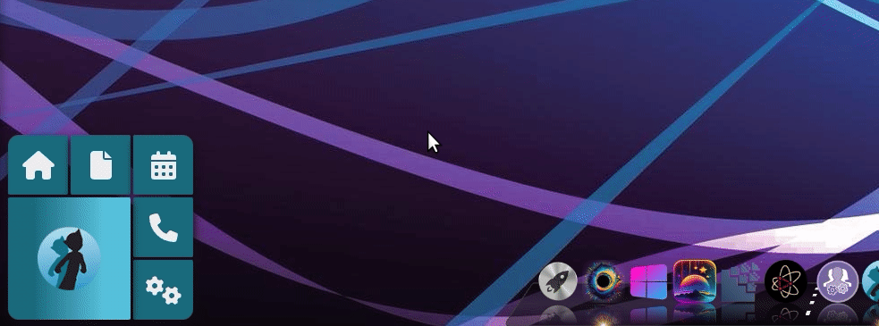

# koad:io Desktop App

The `.koad-io/desktop` folder contains the koad:io Desktop App, which serves as a central hub for managing and launching various koad:io entities and applications on your desktop. This app is designed to provide a seamless desktop experience for koad:io users.

## Overview

The koad:io Desktop App consists of two main components:

1. **Electron App**: This is the core of the desktop application. It provides the taskbar icon, keyboard shortcuts, and a connection to the Meteor/koad:io interface.

2. **Meteor/koad:io Interface**: Located in the `.koad-io/desktop/interface` folder, this is a Meteor/koad:io app that serves as the user interface for managing koad:io entities and launching applications.

## Features

- **Entity Management**: The interface allows users to select and manage their koad:io entities, making it easy to switch between different setups and configurations.

- **Quick Launch**: The desktop app provides a small desktop widget that offers quick access to launch selected koad:io applications.

- **DDP Communication**: The Electron app connects to the interface via DDP (Distributed Data Protocol), enabling real-time communication and updates between the desktop app and the interface.

## Usage

To use the koad:io Desktop App:

1. Clone this repository or ensure you have the `.koad-io/desktop` folder.

2. Start the Electron app by running the appropriate command. Typically, this can be done by running `npm start` or `electron .` from the `.koad-io/desktop` folder.

3. The Electron app will open, providing a taskbar icon and keyboard shortcuts for easy access to your koad:io entities and applications.

4. Launch the Meteor/koad:io interface, which serves as the control panel for managing entities and applications.

5. Use the interface to select your desired koad:io entity and launch applications.

## Getting Started

For more detailed setup instructions and information on configuring the koad:io Desktop App, please refer to the documentation or README files provided in the respective folders.

## Support and Feedback

If you encounter any issues, have suggestions, or need assistance, please don't hesitate to reach out to the koad:io community for support.

Enjoy using the koad:io Desktop App, and streamline your koad:io development and management workflow!
